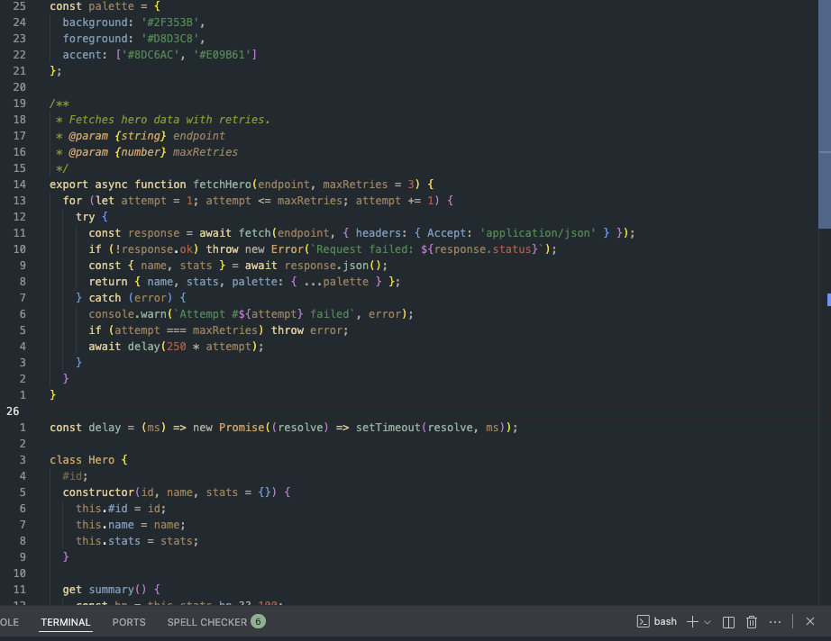
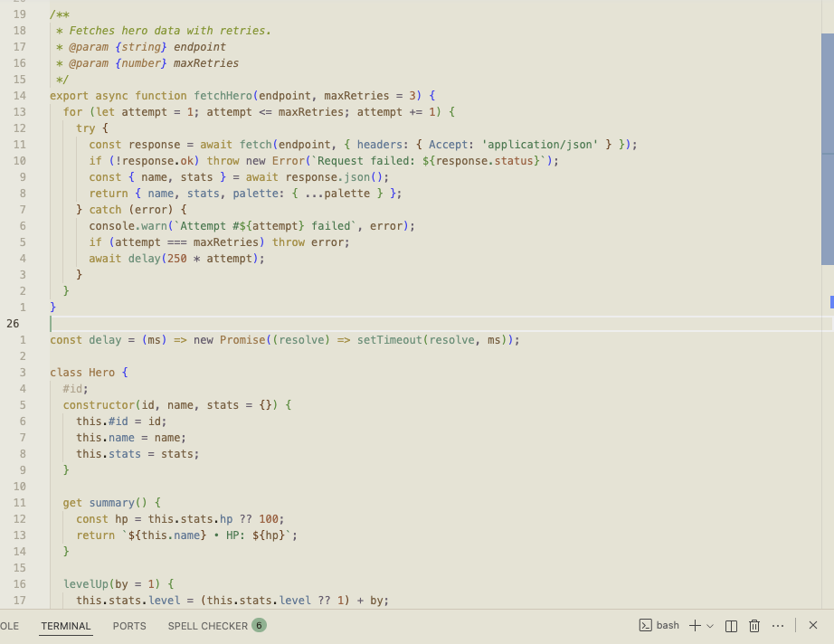

# nkalai Theme

Nkalai is a paired light/dark Visual Studio Code theme designed to stay gentle on your eyes during long editing sessions. The latest update dims the light variant by ~4% and keeps both themes aligned around the same accent green, so flipping between day and night modes stays comfortable.

I originally tweaked Wes Bos’ Cobalt2 theme for personal use, but after so many changes it felt right to publish the result as its own palette. This is a passion project rather than a professional product—I’m simply sharing it in case others find the colours helpful.

## Preview




## Theme Snapshot

| Variant | Background | Foreground | Accent notes |
| --- | --- | --- | --- |
| **nkalai Light** | `#EFEBDE` (soft parchment, 4% dimmer) | `#2F291F` (deep brown) | Accent green `#77B58D` for cursor/selection/badges; strings deep evergreen `#0A7C48`; keywords warm gold `#B58F3A`; operators muted violet-grey `#6B5D6F`. |
| **nkalai Dark** | `#1E2A30` (deep slate) | `#E6E2D9` (warm sand) | Accent green `#77B58D`; strings evergreen `#078A4F`; keywords soft gold `#E6C791`; operators dusty taupe `#B3A799`. |

Both JSON theme files enable semantic highlighting, so language servers can apply the palette to semantic token classifications such as classes, parameters, and readonly properties.

## Installation (Development)
1. Clone this repository and open it with VS Code or VSCodium.
2. Press `F5` (or Run → Start Debugging). The included `.vscode/launch.json` launches a second *Extension Development Host* window.
3. In the Dev Host, open the theme picker (`Cmd+K Cmd+T`) and choose **nkalai Light** or **nkalai Dark**.

## Installation (VSIX)
1. Install the VSCE CLI if you have not already:
   ```bash
   npm install -g @vscode/vsce
   ```
2. From the project root build the package:
   ```bash
   vsce package
   ```
3. In your primary VS Code window, open the Extensions view → “⋯” menu → *Install from VSIX…* and select the generated `.vsix` file.

## Palette Highlights
- **UI chrome:** Shared accent green `#77B58D` across activity bar, status bar, tabs, badges, progress; light surfaces slightly dimmed neutrals (e.g., `#EEEAE2` panels) to reduce glare.
- **Syntax:** Strings evergreen (`#078A4F` dark / `#0A7C48` light); keywords warm gold (`#E6C791` / `#B58F3A`); variables & properties copper (`#AB7E58` / `#855C3C`); data keys cool blue (`#6499B5` / `#4B7A97`); operators muted neutrals for subtle contrast.
- **Terminals:** Backgrounds match the editors (`#1E2A30` dark / `#EFEBDE` light) with cursors and ANSI greens keyed to the accent for consistent inline work.

## Working on the Theme
- Edit `themes/nkalai-light-color-theme.json` or `themes/nkalai-dark-color-theme.json`; both are plain JSON, so run `jq empty themes/*.json` (or rely on VS Code diagnostics) before relaunching.
- Reload the Dev Host via `Developer: Reload Window` to apply colour tweaks instantly.
- Use `Developer: Inspect Editor Tokens and Scopes` to understand which token scopes need new colour assignments.

## Publishing Checklist
1. Update `package.json` metadata (description, keywords, version, icon, gallery banner) before tagging a release.
2. Capture screenshots or GIFs of both variants, add them to `media/`, and reference them from this README and `package.json` for richer Marketplace previews.
3. Run `vsce package` followed by `vsce publish` (requires a Marketplace publisher named in `package.json`’s `publisher` field).

Enjoy the lighter feel without losing contrast, day or night.
